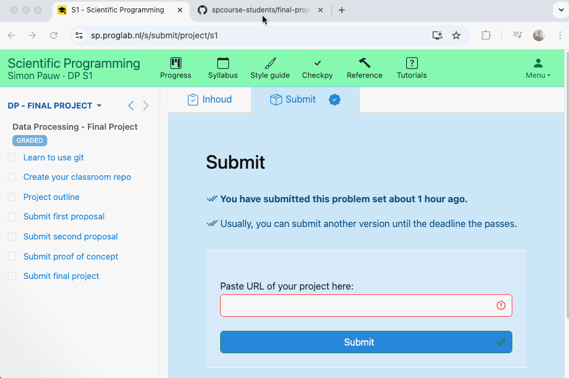

# Submit

- Make sure that you're using a github **classroom** repository!
- Make sure that the proposal has a clearly recognizable name (e.g. `proposal.txt` or `proposal.md`). 
- Submit the link to the github **commit**
    - Go to the github repository page and click on the commit you would like submit (generally the last commit).
    - Copy-paste the link into the website form. 
    - Click submit.
     
- If you have issues submitting, please get help in class!